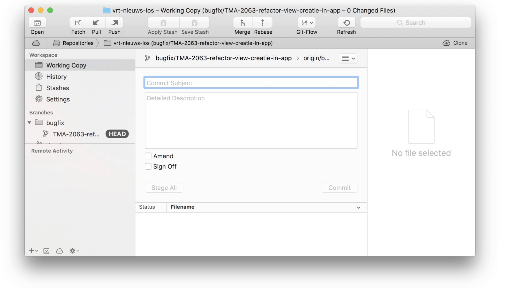
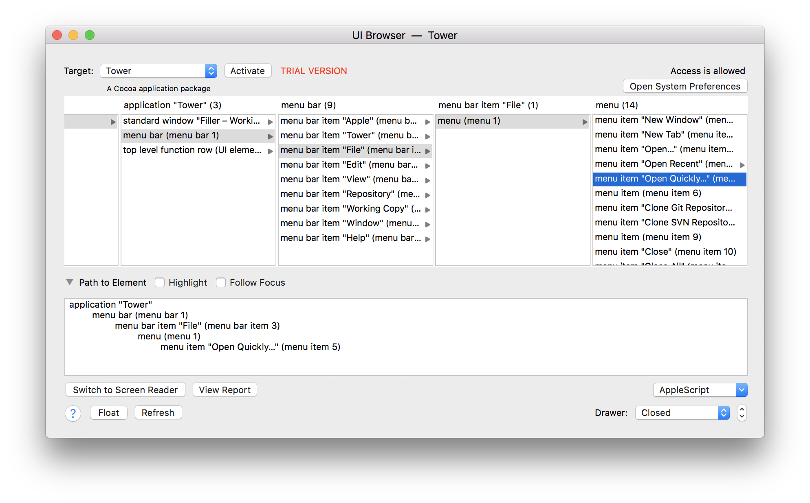
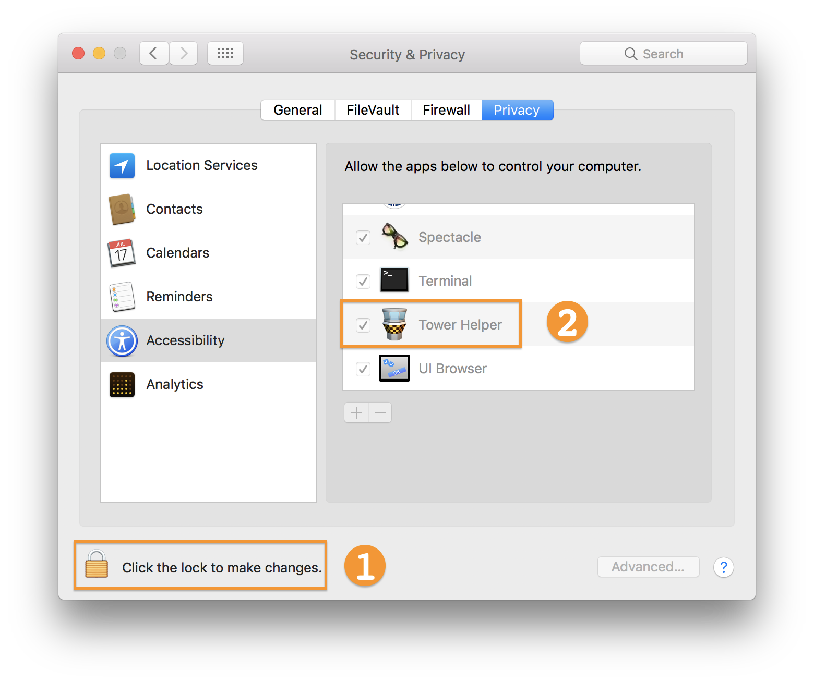

# Filler
Filler is a macOS [JXA](https://developer.apple.com/library/content/releasenotes/InterapplicationCommunication/RN-JavaScriptForAutomation/Articles/Introduction.html) script which automates insertion of a ticket name in commit messages in GUI-based git applications such as Tower or SourceTree.



# Table of contents

<!-- START doctoc generated TOC please keep comment here to allow auto update -->


- [How it works](#how-it-works)
  - [Customizing the script](#customizing-the-script)
  - [Extending the script](#extending-the-script)
- [Download](#download)
- [TODO](#todo)
- [Useful links](#useful-links)
- [License](#license)

<!-- END doctoc generated TOC please keep comment here to allow auto update -->


# How it works

The script uses macOS **GUI scripting** to 'extract' UI elements from Cocoa-based applications. This can be done with Apple Script or JavaScript (JXA). The UI elements can be manipulated as needed. This is obviously not a robust solution, as any update to the application (and thus UI hierarchy) may break the script. A better way to interact with applications is by means of [Apple Events](https://developer.apple.com/library/content/documentation/Cocoa/Conceptual/ScriptableCocoaApplications/SApps_handle_AEs/SAppsHandleAEs.html), but not all apps expose or support those. For applications which don't expose Apple Events, UI automation is a valid, yet slightly cumbersome, alternative.

The script currently works with [Tower](https://www.git-tower.com/mac/) and [SourceTree](https://www.sourcetreeapp.com) but can be easily extended. For more info on GUI scripting with JXA, see [useful links](#useful-links) section below

## Customizing the script

The first thing you will want to customize are the properties which describe the structure of a ticket / issue name. Simply adjust the `ticketProperties` , shown below are the properties to match an example Jira ticket with name: *TMA-1004*. These properties are then used to create a regular expression which does the actual matching.

```javascript
const ticketProperties = {
	prefix: 'TMA',
	delimiter: '-',
	numberOfDigits: 4
}
```

Another important property is the `selectedApplication`. This should point to an object which is defined higher up in the `applications` variable. This is how you make the script run for Tower:

```javascript
const selectedApplication = applications.Tower
```

## Extending the script

Currently, the script has been tested and confirmed to be working with Tower 2.6.1 and SourceTree 2.4.1.

However, you can add other applications to the script by defining the relevent properties in the `applications` variable. To add a new application you need to know the:

- **application name** as seen in the menu bar next to the  menu item,
- the UI hierarchy "**path**" pointing to the **commit** field, i.e. where you would *type* the commit message,
- and the UI hierarchy "**path**" pointing to current **active branch** name. The branch name should *contain* the ticket number you wish to insert in the commit field.

Take a look at this example for Tower:

```javascript
const applications = {
	Tower: {
		process: getProcess('Tower'),
		get commitField() { return this.process.windows[0].splitterGroups[0].splitterGroups[0].textFields[1] },
		get branchName() { return this.process.windows[0].splitterGroups[0].splitterGroups[0].buttons[0].title() }
	}
}
```

The hardest part is figuring out the exact hierarchy of the UI elements. To explore the UI hierarchy of any Cocoa application you can use various tools to make your life easier:

- Apple's [Accessibility Inspector](https://developer.apple.com/library/content/documentation/Accessibility/Conceptual/AccessibilityMacOSX/OSXAXTestingApps.html) (included with Xcode)
- PFiddlesoft's excellent [UI Browser](http://pfiddlesoft.com/uibrowser/) (which can output usable AppleScript snippets)




# Download

Below can download an exported version of the script as standalone "stay-open" app:

- [Tower Helper](https://github.com/Kymer/Filler/raw/master/builds/Tower%20Helper.zip)
- [SourceTree Helper](https://github.com/Kymer/Filler/raw/master/builds/SourceTree%20Helper.zip)


Make sure you add the downloaded app to Accessibility list under Privacy tab in the *System Preferences > Security & Privacy* pref pane.

# TODO

- [ ] Add instructions on how to export the script to a standalone app
- [ ] More robust and flexible ticket name matching
- [ ] Create custom logo / icon
- [ ] Transition this project to a headless app that lives in the menu bar

# Useful links
- [How Cocoa Applications Handle Apple Events](https://developer.apple.com/library/content/documentation/Cocoa/Conceptual/ScriptableCocoaApplications/SApps_handle_AEs/SAppsHandleAEs.html) - official documentation by Apple
- [Getting Started with JavaScript for Automation on Yosemite](https://www.macstories.net/tutorials/getting-started-with-javascript-for-automation-on-yosemite/) - by Alex Guyot on MacStories
- [JXA Cookbook](https://github.com/dtinth/JXA-Cookbook/wiki) - by Thai Pangsakulyanont on GitHub
- [List of JXA resources](https://gist.github.com/JMichaelTX/d29adaa18088572ce6d4) - by JMichaelTX on GitHub

# License

MIT © Kymer Gryson
