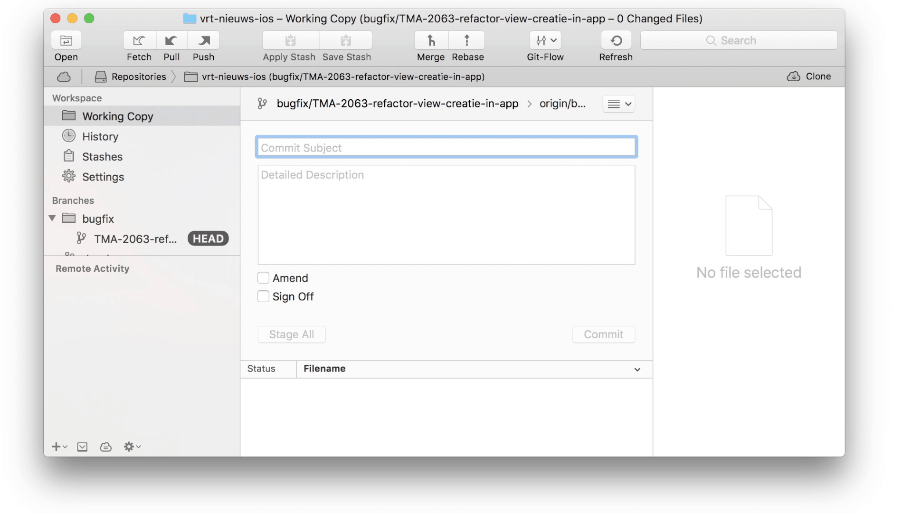

# Filler
Filler is a JXA script which automates prepending of ticket names in commit messages in GUI-based git applications such as Tower or SourceTree.

# Useful links
- [How Cocoa Applications Handle Apple Events](https://developer.apple.com/library/content/documentation/Cocoa/Conceptual/ScriptableCocoaApplications/SApps_handle_AEs/SAppsHandleAEs.html) - official documentation by Apple
- [Getting Started with JavaScript for Automation on Yosemite](https://www.macstories.net/tutorials/getting-started-with-javascript-for-automation-on-yosemite/) - by Alex Guyot on MacStories
- [JXA Cookbook](https://github.com/dtinth/JXA-Cookbook/wiki) - by Thai Pangsakulyanont on GitHub
- [List of JXA resources](https://gist.github.com/JMichaelTX/d29adaa18088572ce6d4) - by JMichaelTX on GitHib

## License

MIT © Kymer Gryson
